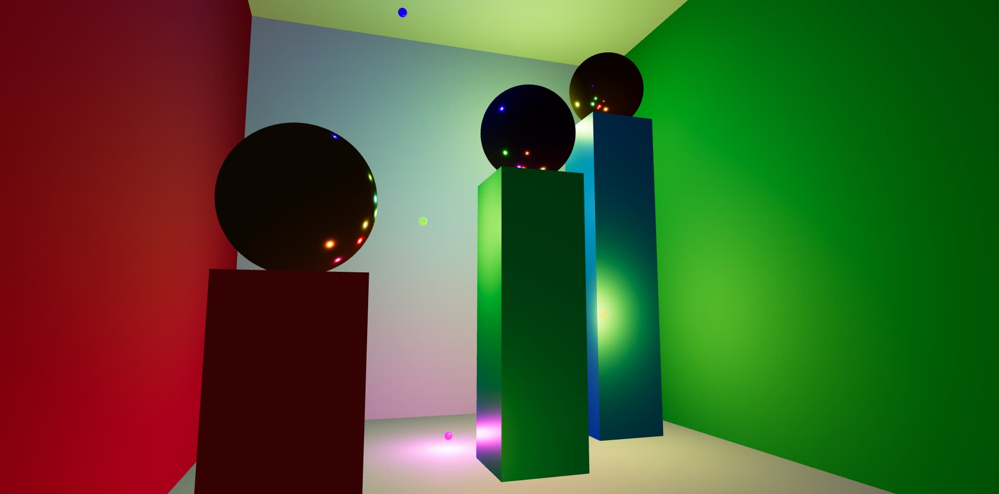

<div>

# Cornell Box

### *An interactive lighting scene built with Three.js*
A 3D scene that explores lighting, materials, and movement
within a controlled enclosed space.

</div>

---

## Table of Contents

- [Description](#description)
- [Features](#features)
- [Project Structure](#project-structure)
- [Technologies](#technologies)
- [Quick Start](#quick-start)
- [Scene Architecture](#scene-architecture)
- [Materials and Textures](#materials-and-textures)
- [Lighting System](#lighting-system)
- [Interactivity](#interactivity)
- [Technical Decisions](#technical-decisions)
- [Future Improvements](#future-improvements)

---

## Description

Cornell Box is a modern reimplementation of the famous reference scene used in computer graphics to study light behavior.

This project transforms the classic concept into an interactive experience: a closed box with colored walls, pillars of different heights, and luminous spheres that travel through the space on unique trajectories.

> *It's not just a static scene. Each element has a life of its own: the spheres navigate, the light travels with them, and the observer can explore the space from any angle.*

---

## Features

| Feature | Detail |
|---------|--------|
| **Classic Cornell Box** | 5 planes forming a closed space with colored walls |
| **3 Pillars** | Different heights (short, medium, tall) with metallic spheres on top |
| **8 Luminous spheres** | Move on unique trajectories inside the box |
| **Point lights** | Each traveling sphere emits light that travels with it |
| **Soft shadows** | PCF Soft Shadow Map for realistic rendering |
| **Cinematic tone** | ACES Filmic Tone Mapping for balanced colors |
| **Camera control** | OrbitControls with damping for smooth exploration |
| **Responsive** | Adapts to any window size |

---

## Project Structure

```
cornell/
├── index.html      ← Entry point with Three.js importmap
├── main.js         ← All scene logic
├── styles.css      ← Base styles and fullscreen canvas
├── img/
│   └── preview.svg ← Scene preview image
└── README.md       ← This file
```

> *No local dependencies. Three.js is loaded directly from CDN via importmap.*

---

## Technologies

| Technology | Version | Usage |
|------------|---------|-------|
| **Three.js** | `0.164.1` | 3D rendering, geometries, materials, lights |
| **OrbitControls** | — | Mouse-based camera navigation |
| **HTML5** | — | Document structure |
| **CSS3** | — | Reset and fullscreen canvas |
| **JavaScript ES Modules** | — | Modular code with import/export |

---

## Quick Start

### Requirements

- A modern browser (Chrome, Firefox, Safari, Edge)
- A local server (doesn't work with `file://` due to ES module restrictions)

### Execution

**Option 1 — Python**

```bash
python -m http.server 8000
```

**Option 2 — Node.js**

```bash
npx serve
```

**Option 3 — VS Code**

Use the **Live Server** extension and click *Go Live*.

<br/>

Then open in the browser:

```
http://localhost:8000
```

---

## Scene Architecture

### Box Dimensions

| Axis | Units | Description |
|------|-------|-------------|
| **X** | 4 | Width (left ↔ right) |
| **Y** | 4 | Height (floor ↔ ceiling) |
| **Z** | 4 | Depth (front ↔ back) |

### Box Planes

```
        ┌─────────────────┐
       ╱                 ╱│
      ╱    Ceiling      ╱  │
     ╱   (yellow)     ╱    │
    ┌─────────────────┐     │
    │                 │     │
    │    Back Wall    │     │
    │     (white)     │     │
    │                 │     │
    │  ┌──────────────┼─────┘
    │  │              │    ╱
    │  │    Floor     │  ╱
    │  │   (white)    │╱
    └──┼──────────────┘
       │
    Left           Right
     Wall           Wall
    (red)         (green)
```

| Plane | Color | Material |
|-------|-------|----------|
| Floor | `#cccccc` | Neutral white, roughness 0.9 |
| Back Wall | `#cccccc` | Neutral white, roughness 0.9 |
| Left Wall | `#cc3333` | Red, roughness 0.8 |
| Right Wall | `#33aa33` | Green, roughness 0.8 |
| Ceiling | `#fdfd96` | Pastel yellow, roughness 0.8 |

### Pillars

Three pillars of different heights distributed inside the box:

| Pillar | Position | Height | Base Color | Top Sphere |
|--------|----------|--------|------------|------------|
| **Short** | Front left `(-1.3, 0.6, 1.0)` | 1.2 | Red `#e74c3c` | Yellow `#f1c40f` |
| **Medium** | Center `(0.2, 1.0, 0.0)` | 2.0 | Green `#2ecc71` | Purple `#9b59b6` |
| **Tall** | Back right `(1.3, 1.4, -0.8)` | 2.8 | Blue `#3498db` | Orange `#e67e22` |

---

## Materials and Textures

### PBR System

All materials use **MeshStandardMaterial**, Three.js's *Physically Based Rendering* model.

| Property | Function |
|----------|----------|
| `roughness` | Controls light diffusion (0 = mirror, 1 = matte) |
| `metalness` | Defines if material is metallic (0 = dielectric, 1 = metal) |
| `emissive` | Self-emission color (for luminous spheres) |
| `emissiveIntensity` | Emission glow intensity |

### Pillar Materials

```javascript
// Medium roughness + medium metalness = semi-metallic finish
roughness: 0.4
metalness: 0.5
```

### Top Sphere Materials

```javascript
// Low roughness + high metalness = sharp reflections
roughness: 0.1
metalness: 0.9
```

### Traveling Sphere Materials

```javascript
// Self-emission + high metalness = visible from any angle
emissive: sphereColors[i]
emissiveIntensity: 1.2
metalness: 0.8
```

---

## Lighting System

### Base Lighting

| Type | Color | Intensity | Function |
|------|-------|-----------|----------|
| **AmbientLight** | `#ffffff` | 0.5 | Uniform minimum lighting so nothing is pure black |

### Dynamic Lighting

Each of the **8 traveling spheres** has an associated `PointLight`:

| Parameter | Value |
|-----------|-------|
| Intensity | `2` |
| Range | `4` units |
| Shadows | Enabled (PCF Soft) |

> *The light travels with the sphere. As it moves through the box, it illuminates the walls, pillars, and other spheres creating a moving light show.*

### Shadow Configuration

```javascript
renderer.shadowMap.enabled = true;
renderer.shadowMap.type = THREE.PCFSoftShadowMap;
```

| Setting | Value |
|---------|-------|
| Shadow Type | PCF Soft Shadow Map |
| Shadow Map Size | 1024 × 1024 |
| Tone Mapping | ACES Filmic |
| Exposure | 1.0 |

---

## Interactivity

### Camera Navigation

| Action | Behavior |
|--------|----------|
| **Left click + drag** | Rotates the camera around the point of interest |
| **Scroll** | Zoom in / zoom out |
| **Right click + drag** | Pans the camera laterally |

**Damping configuration:**

```javascript
controls.enableDamping = true;
controls.dampingFactor = 0.05;
```

Damping creates a smooth transition when releasing the mouse, eliminating abrupt movement.

### Traveling Spheres Movement

Each sphere has unique randomly generated parameters:

| Parameter | Range | Description |
|-----------|-------|-------------|
| `speedX` | 1.5 — 3.5 | Movement speed on X axis |
| `speedY` | 1.0 — 2.5 | Movement speed on Y axis |
| `speedZ` | 1.2 — 3.0 | Movement speed on Z axis |
| `radiusX` | 0.5 — 1.5 | Movement amplitude on X |
| `radiusZ` | 0.5 — 1.5 | Movement amplitude on Z |
| `baseY` | 0.3 — 2.8 | Base height of movement |
| `amplitudeY` | 0.3 — 1.1 | Vertical amplitude |

**Trajectory calculated per frame:**

```javascript
x = sin(t * speedX + offset) * radiusX
z = cos(t * speedZ + offset * 1.3) * radiusZ
y = baseY + sin(t * speedY + offset * 0.7) * amplitudeY
```

Spheres are **constrained** inside the box (limit ±1.7 on X/Z, 0.1 to 3.9 on Y).

---

## Technical Decisions

### Why importmap?

The project uses **importmap** to load Three.js directly from CDN without a bundler.

```html
<script type="importmap">
{
  "imports": {
    "three": "https://unpkg.com/three@0.164.1/build/three.module.js",
    "three/addons/": "https://unpkg.com/three@0.164.1/examples/jsm/"
  }
}
</script>
```

**Advantages:**
- No `node_modules`
- No webpack/vite/rollup configuration
- Compatible with all modern browsers

### Why MeshStandardMaterial?

`MeshStandardMaterial` is Three.js's standard for PBR. It offers:

- Visually consistent results
- Intuitive parameters (roughness, metalness)
- Future compatibility with IBL (Image-Based Lighting)

### Why PCFSoftShadowMap?

Produces shadows with softened edges, more realistic than `BasicShadowMap` hard shadows.

---

## Future Improvements

- [ ] **HDR Environment Map** — Add environment map for more realistic reflections
- [ ] **Post-processing** — Bloom, ambient occlusion, custom tone mapping
- [ ] **Mouse interaction** — Raycasting to detect and manipulate objects
- [ ] **GLTF Animations** — Import external 3D models
- [ ] **Spatial audio** — Sounds that react to sphere positions
- [ ] **Day/Night mode** — Toggle between natural and artificial lighting
- [ ] **Export scene** — Function to download the scene as an image

---

<div align="center">
*Light doesn't just illuminate objects. It defines them.*
<br/>
Made with ❤️ by <a href="https://sebas-dev.vercel.app/" target="_blank" rel="noopener noreferrer">Sebastián V</a>
</div>
